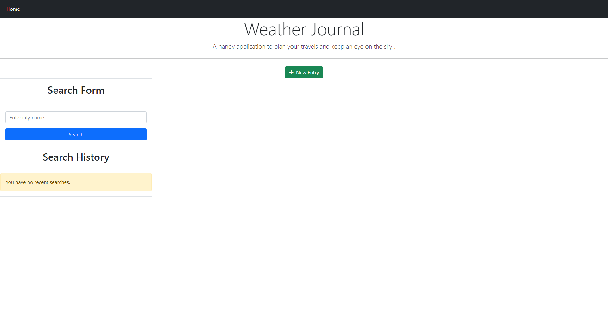
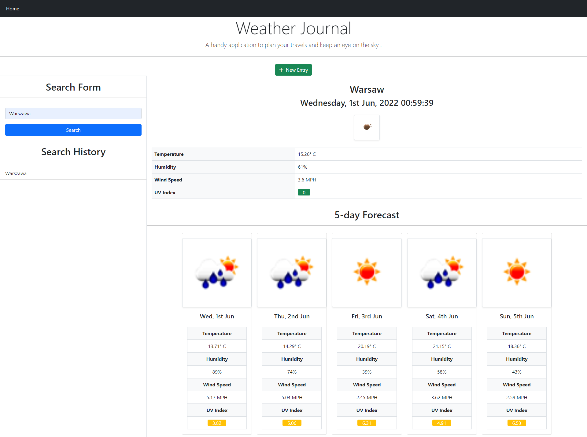
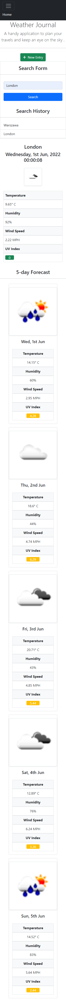

# Weather Dashboard

### A handy application to search weather conditions worldwide.

# How It Works

When the user inputs the name of a city or region in the search box the application will display the current weather conditions and the forecast for the next 5 days. Recent searches are displayed under the search input field and can be selected to prompt the app in displaying the current and future weather conditions.

# Languages/ Libraries & Frameworks Used

I have used HTML, CSS, JavaScript , Moment JS, JQuery, and Bootstrap.

# API

Open weather api to retrieve the weather information.

# Mock-Up

Link to deployed page: https://katarzynajk.github.io/weather-dashboard/

The following images show the web application's appearance and functionality:

# Screenshots

